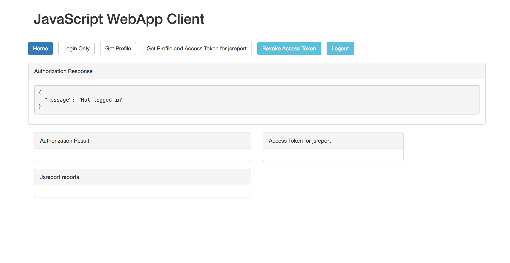
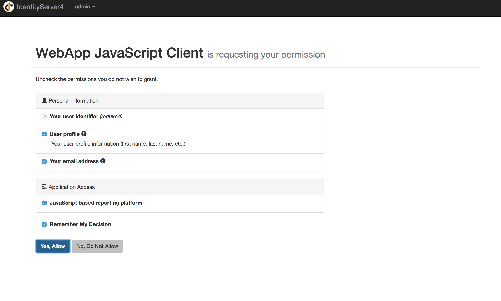

# jsreport authentication with authorization server (IdentityServer4)

Sample demonstrating how to delegate authentication in jsreport to an external authorization server to support Single Sign On

 > Sample based on the [original Node.js API IdentityServer4 sample](https://github.com/IdentityServer/IdentityServer4.Samples/tree/release/NodeJsApi)

## Overview

This sample has three different applications:

- An authorization server (running on port `5000`, powered by [IdentityServer4](https://github.com/IdentityServer/IdentityServer4))
- A jsreport server (in terms of OAuth2/OpenID Connect jsreport is a resource server here, jsreport is running on port `5004` and it is configured to delegate authentication to the authorization server)
- A WebApp client application (running on port `5005`)

The authentication flow starts when the user loads the WebApp client application, in order to be able to render some reports (from jsreport) directly from the WebApp the user needs to be authenticated, to do that user clicks "Get Profile and Access Token for jsreport" button, user is asked to insert its credentials, then it is asked to authorize jsreport application access, after the authentication is done the user is able to see a list of reports available in jsreport and have the option to render any of them.

The sample demonstrates how jsreport can be exposed as a product with Single Sign On support and how it can be accessed from another application (for example a WebApp application).

## Running the sample

### Initialize

1. make sure you have .NET Core (1.0 or 1.1) and Node.js (>=4) installed

2. `git clone https://github.com/bjrmatos/jsreport-with-authorization-server-sample.git`

3. add to `/etc/hosts` or to `C:\Windows\System32\drivers\etc` in windows the following line: 
`127.0.0.1  jsreport-sample.com`
This will map the domain where the sample will run to the local.

### Starting authorization server

Open `authorization-server.sln` in VS and hit F5 or open command line and run the following command:

```sh
dotnet restore
dotnet run
```

You should check the running server through the browser on [http://jsreport-sample.com:5000](http://jsreport-sample.com:5000)

### Starting jsreport server
1. open `jsreport-server` directory in command line
2. `npm install`
3. `npm start`
4. Check the running jsreport on [http://jsreport-sample.com:5004](http://jsreport-sample.com:5004)

### Starting sample web app

1. open `webapp-client` directory in command line
2. `npm install`
3. `npm start`
4. Check the running app on [http://jsreport-sample.com:5005](http://jsreport-sample.com:5005)

## Testing auth workflow in sample

Open [http://jsreport-sample.com:5005](http://jsreport-sample.com:5005)  in your browser and click the "Get Profile and Access Token for jsreport" Button (`User: admin, Password: password`):




5. Authorize jsreport application access



6. Render some reports


## Technical notes

### authorization server
The implementation builds on the original [Identity Server sample](https://github.com/IdentityServer/IdentityServer4.Samples/tree/release/NodeJsApi). We just removed the authentication through credentials and use host name instead of host IP to simplify the sample startup. The `Config.cs` then includes some changes which are discussed in the next chapter.

### jsreport configuration
jsreport server is running with default `dev.config.json` configuration except the `authorizationServer` node in the config.

```js
"authorizationServer": {
	"tokenValidation": {
		"endpoint": "http://jsreport-sample.com:5000/connect/introspect",
        "usernameField": "username",
        "activeField": "active",
        "scope": {
          "valid": ["jsreport"]
        },
        "auth": {
          "type": "basic",
          "basic": {
            "clientId": "jsreport",
	        "clientSecret": "secret"
	    }
	}
}
```

The values here should correspond with the authorization server configuration. Namely


#### usernameField
This determines which jsreport user should be used based on the response from the authorization server. In this case the authorization server defines this field using the list of claims. See `Config.cs`.

```cs
new TestUser {
 SubjectId = "1",
  Username = "admin",
  Password = "password",

  Claims = new List < Claim > {
   new Claim("username", "admin"),
   new Claim("name", "Admin"),
   new Claim("website", "https://admin.com")
  }
};
```

Here we define that the admin user authenticated though authorization server should be authenticated as admin in jsreport. We can also add the claim `new Claim("username", "admin")` to any other user and let it be authenticated as jsreport admin. See `TestUsers.cs`.

#### auth
The authorization server is not public and jsreport needs to be authenticated. In this case we use `basic` authentication with defined `secret`. See the `Config.cs#GetApiResources` for corresponding values.

### web app client
The web app client is mostly taken from the original [Identity Server sample](https://github.com/IdentityServer/IdentityServer4.Samples/tree/release/NodeJsApi). The same code is used to request the authentication. The most notable part is that the output access token is then passed to the jsreport server through request `Authorization` header.
```js
xhr.open("POST", "http://" + authorizationServer + ":5004/api/report", true);
xhr.setRequestHeader("Authorization", "Bearer " + user.access_token);
```