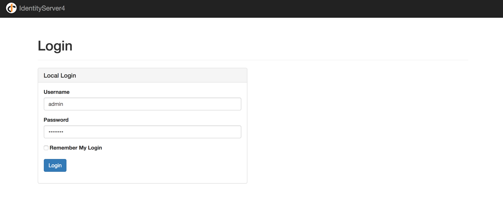
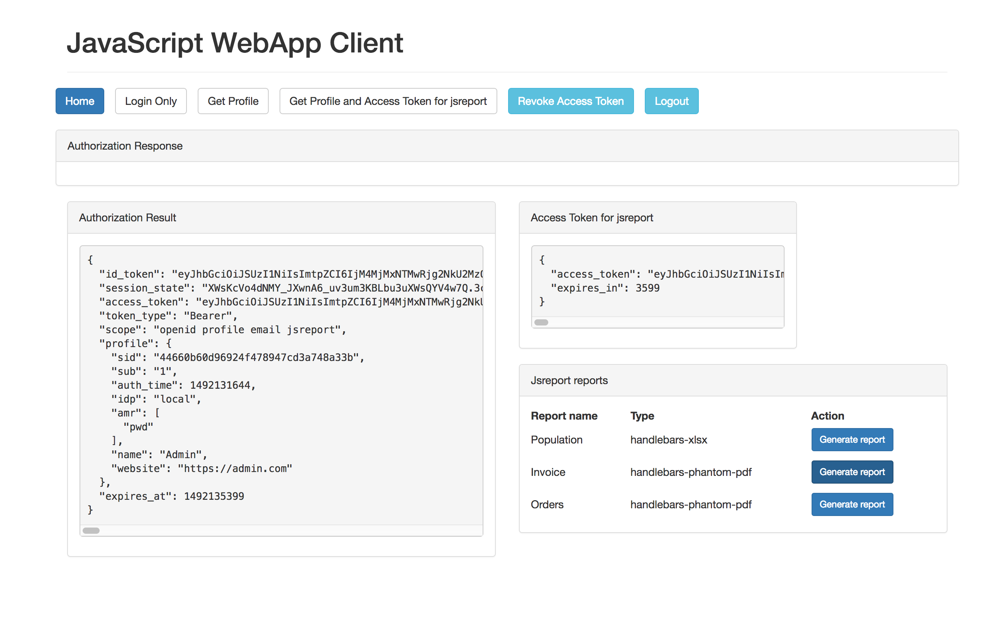
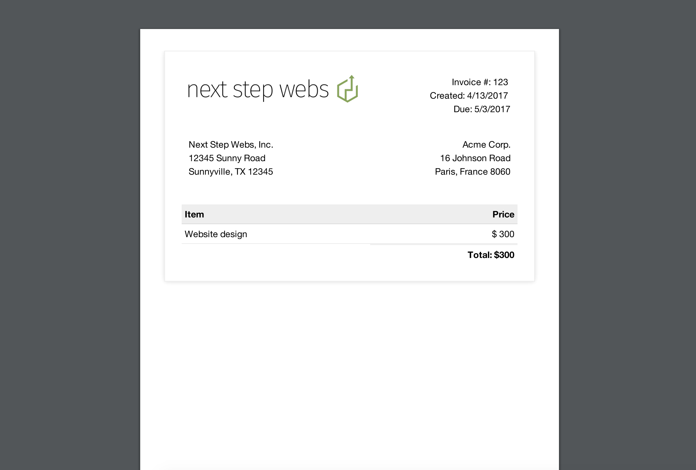

# jsreport authentication with authorization server (IdentityServer4)

Sample demonstrating how to delegate authentication in jsreport to an external authorization server to support Single Sign On

 > Sample based on the [original Node.js API IdentityServer4 sample](https://github.com/IdentityServer/IdentityServer4.Samples/tree/release/NodeJsApi)

## Requirements

- .NET Core 1.0 or 1.1
- Node.js >= 4.x.x

## Overview

This sample has three different applications:

- An authorization server (running on port `5000`, powered by [IdentityServer4](https://github.com/IdentityServer/IdentityServer4))
- A jsreport server (in terms of OAuth2/OpenID Connect jsreport is a resource server here, jsreport is running on port `5004` and it is configured to delegate authentication to the authorization server, check the necessary config to do this in `authentication.authorizationServer` options of `jsreport-server/dev.config.json` file)
- A WebApp client application (running on port `5005`)

The authentication flow starts when the user loads the WebApp client application, in order to be able to render some reports (from jsreport) directly from the WebApp the user needs to be authenticated, to do that user clicks "Get Profile and Access Token for jsreport" button, user is asked to insert its credentials, then it is asked to authorize jsreport application access, after the authentication is done the user is able to see a list of reports available in jsreport and have the option to render any of them.

The sample demonstrates how jsreport can be exposed as a product with Single Sign On support and how it can be accessed from another application (for example a WebApp application).

## Running the sample

1. Create a signing certificate by running `create_signing_cert.sh`. Make sure leave the "Export Password" empty.

2. Run `npm install`

3. Run `npm start`

4. Open `http://<ipaddress>:5005` (it is important that you put your real ip address an not just `localhost`) in your browser and click the "Get Profile and Access Token for jsreport" Button (`User: admin, Password: password`):

5. Authorize jsreport application access

6. Render some reports

