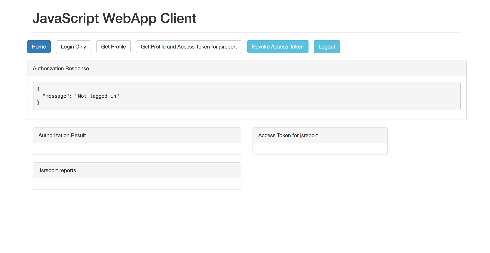
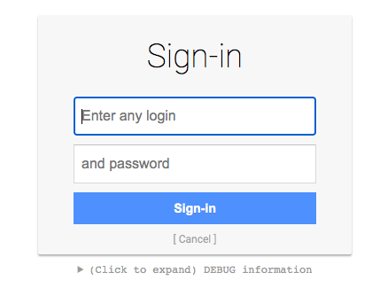
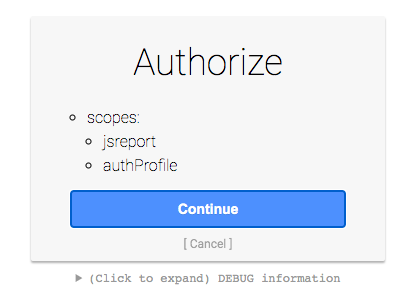
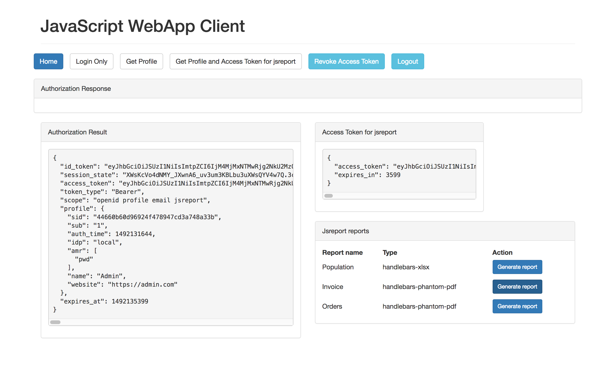
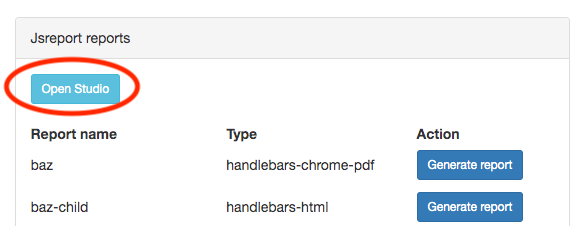
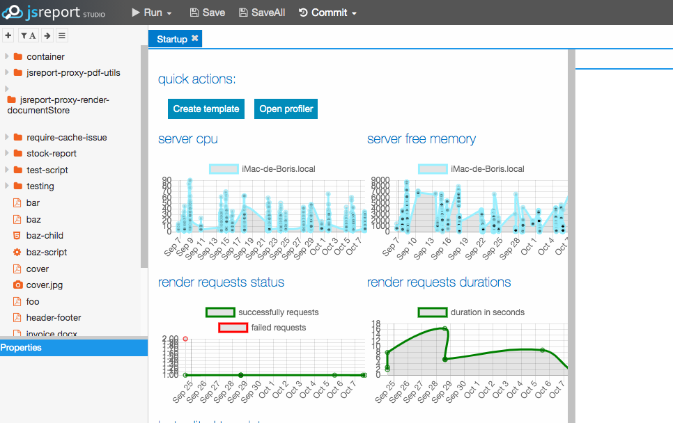

# jsreport authentication with authorization server

Sample demonstrating how to delegate authentication in jsreport to an external authorization server to support Single Sign On

## Overview

This sample has three different applications:

- An [OpenID](https://openid.net/) authorization server (running on port `5005`, powered by [oidc-provider](https://github.com/panva/node-oidc-provider))
- A jsreport server (in terms of OAuth2/OpenID jsreport is both a client (jsreport studio) and a resource server (jsreport http api) here, jsreport is running on port `5004` and it is configured to delegate studio authentication and http api authentication to the authorization server)
- A WebApp client application (running on port `5006`)

The authentication flow starts when the user loads the WebApp client application, in order to be able to render some reports (from jsreport) directly from the WebApp the user needs to be authenticated, to do that user clicks "Get Profile and Access Token for jsreport" button, user is asked to insert its credentials, then it is asked to authorize jsreport application access, after the authentication is done the user is able to see a list of reports available in jsreport and have the option to render any of them.

You are also able to load the jsreport studio and use it without entering any credentials (only it will required to authorize the studio to access its information), this is possible because you have authenticated already with the authorization server. To see this in action just click the "Open Studio" button on the WebApp.

The sample demonstrates how jsreport can be exposed as a product with Single Sign On support and how it can be accessed from another application (for example a WebApp application).

## Running the sample

### Initialize

1. make sure you have Node.js (>=18.15) installed

2. `git clone https://github.com/bjrmatos/jsreport-with-authorization-server-sample.git`

3. add to `/etc/hosts` or to `C:\Windows\System32\drivers\etc` in windows the following line: <br/>
`127.0.0.1  jsreport-sample.com`<br/>
This will map the domain where the sample will run to the local.

### Starting authorization server

1. open `authorization-server` directory in command line
2. `npm install`
3. `npm start`
4. Check the running server on [http://jsreport-sample.com:5005](http://jsreport-sample.com:5005)

### Starting jsreport server
1. open `jsreport-server` directory in command line
2. `npm install`
3. `npm start`
4. Check the running jsreport on [http://jsreport-sample.com:5004](http://jsreport-sample.com:5004)

### Starting sample web app

1. open `webapp-client` directory in command line
2. `npm install`
3. `npm start`
4. Check the running app on [http://jsreport-sample.com:5006](http://jsreport-sample.com:5006)

## Testing auth workflow in sample

1. Open [http://jsreport-sample.com:5006](http://jsreport-sample.com:5006)  in your browser and click the "Get Profile and Access Token for jsreport" Button (`User: admin, Password: password`):





2. Authorize jsreport application access



3. Render some reports




4. Open Studio and verify you are also authenticated there





## Technical notes

### authorization server
The implementation builds on the node.js [oidc-provider](https://github.com/panva/node-oidc-provider), and use the defaults and some extra option to provide a working authorization server for the demo.

### jsreport configuration
jsreport server is running with `jsreport.config.json` configuration with additional `authorizationServer` field in the config.

```js
"authorizationServer": {
  "name": "AuthServer",
  "issuer": "http://jsreport-sample.com:5005",
  "endpoints": {
    "jwks": "http://jsreport-sample.com:5005/.well-known/openid-configuration/jwks",
    "authorization": "http://jsreport-sample.com:5005/connect/authorize",
    "token": "http://jsreport-sample.com:5005/connect/token",
    "introspection": "http://jsreport-sample.com:5005/connect/introspect",
    "userinfo": "http://jsreport-sample.com:5005/connect/userinfo"
  },
  "studioClient": {
    "clientId": "jsreport-studio",
    "clientSecret": "secret"
  },
  "apiResource": {
    "clientId": "jsreport-api",
    "clientSecret": "secret"
  },
  "authorizationRequest": {
    "scope": ["jsreport", "authProfile"]
  },
  "introspectionRequest": {
    "tokenValidScopes": ["jsreport"]
  }
}
```

The values here should correspond with the authorization server configuration. we define that the admin user authenticated though authorization server should be authenticated as admin in jsreport.

#### auth
The authorization server is not public and jsreport (studio and http api) needs to be authenticated. In this case we use `studioClient` and `apiResource` which contains the credentials for each type of client.

### web app client
The most notable part is that the output access token (obtained from authorization server) is then passed to the jsreport server through request `Authorization` header, which will authenticate the call accordingly.
```js
xhr.open("POST", "http://" + authorizationServer + ":5004/api/report", true);
xhr.setRequestHeader("Authorization", "Bearer " + user.access_token);
```
